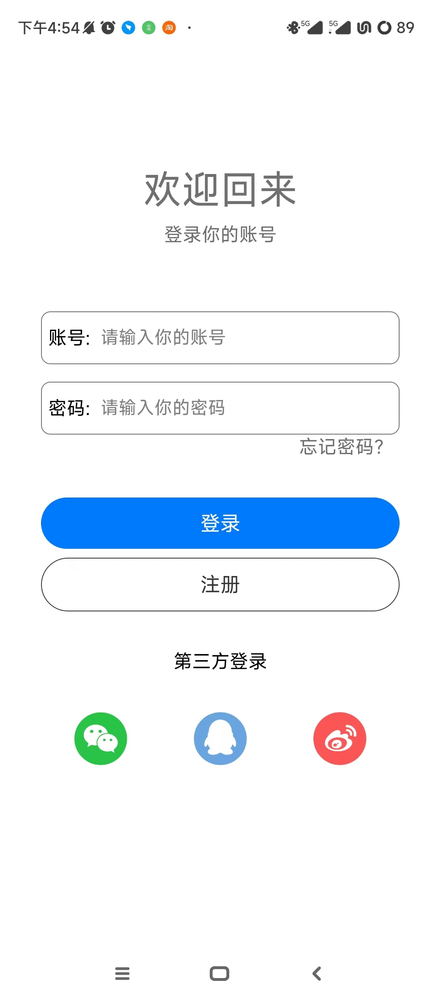
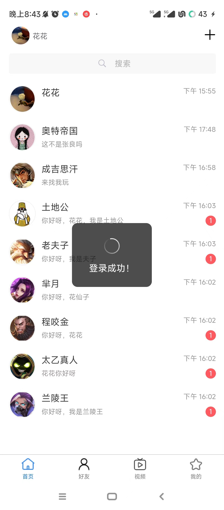
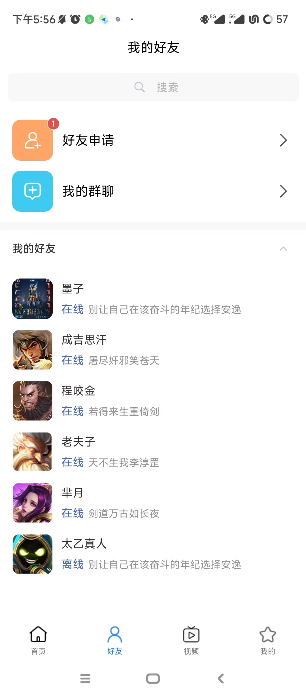
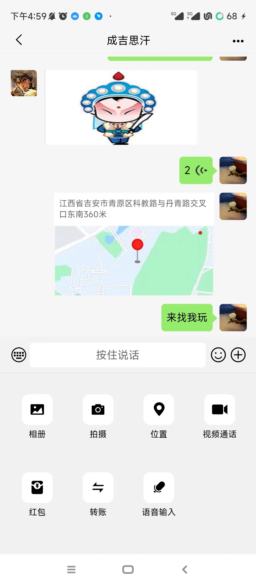
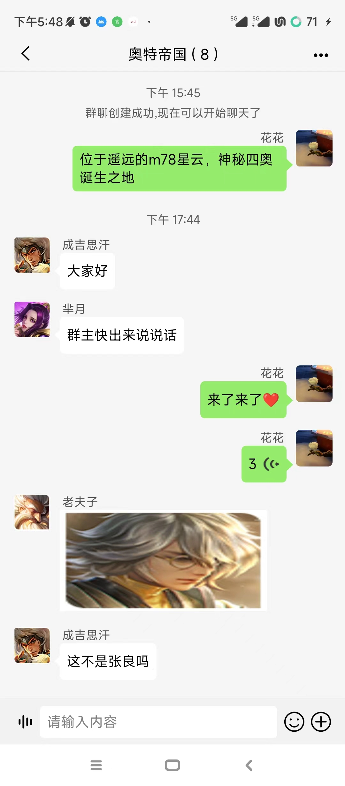
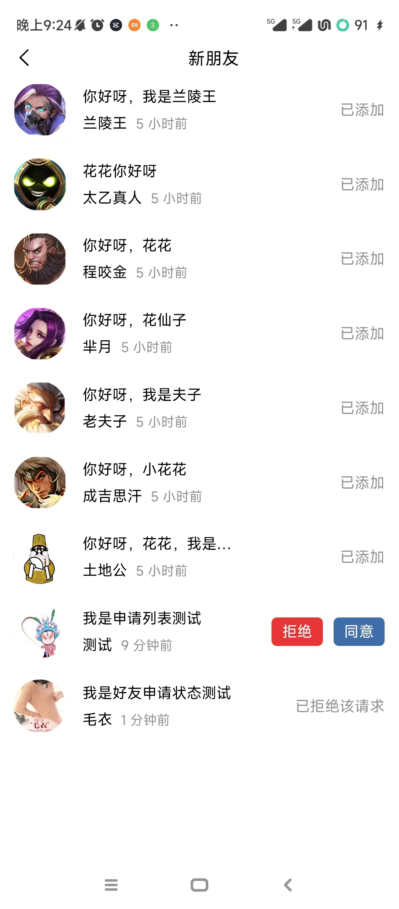
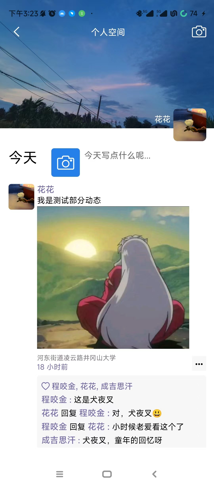
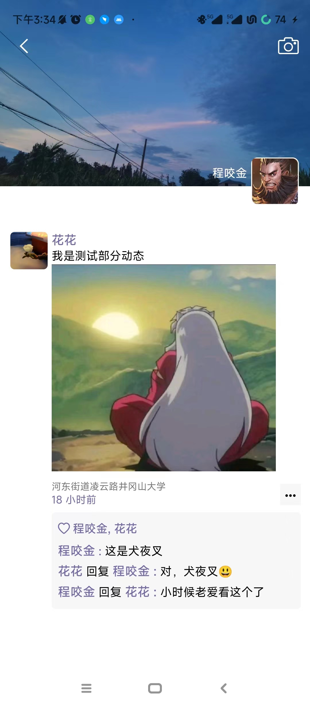

# **UniApp + Vue3 跨端开发：Node.js 全栈实现 H5/公众号/APP 多端兼容应用**
## 项目介绍
本项目基于 uni-app + vue3 + sequlize+ node.js+express + mysql + socket.io + pinia 开发，实现跨端多端兼容应用，兼容h5、公众号、App。

## 项目运行后端

1. 克隆项目到本地

   ```tex
   https://github.com/lw20001210/Chat_Lucky.git
   ```

2. 安装依赖

   ```tex
   cd luckyNode
   npm install
   ```

3. 修改运行项目设置环境变量

   ```js
   luckyNode/config.js
   
   module.exports = {
     Keys: "lw",  // 加密和解密 Token 的秘钥
     times: "100h",  // token 的有效期
     mainUrl: "localhost", //主机地址
   }
   
   ```

4. 修改数据库设置

   ```js
   luckyNode/mysql/sequlize
   
   const Sequelize = require("sequelize");
   const sequelize = new Sequelize("数据库名", "用户名", "密码", {
     host: "localhost", //主机地址
     port:"3306", //端口号
     dialect: "mysql", //数据库类型
     logging: false, //是否打印日志
   });
   
   module.exports = sequelize;
   ```

5. 运行项目

   ```js
   nodemon main.js
   ```

## 项目运行前端

1. 克隆项目到本地

   ```tex
   https://github.com/lw20001210/Chat_Lucky.git
   ```

2. 安装依赖

   ```tex
   cd lucky
   npm install
   ```

3. 修改运行项目设置环境变量

   ```tex
   cd utils/config.js
   export const mainUrl="localhost" //主机地址
   ```

4. 运行项目

   ```tex
   在HBuilderX编辑器点击运行，选择运行到指定浏览器
   ```

5. 打包成App

   ```tex
   在HBuilderX编辑器点击发行，选择云打包，云端证书打包
   ```

## 项目部分截图


















